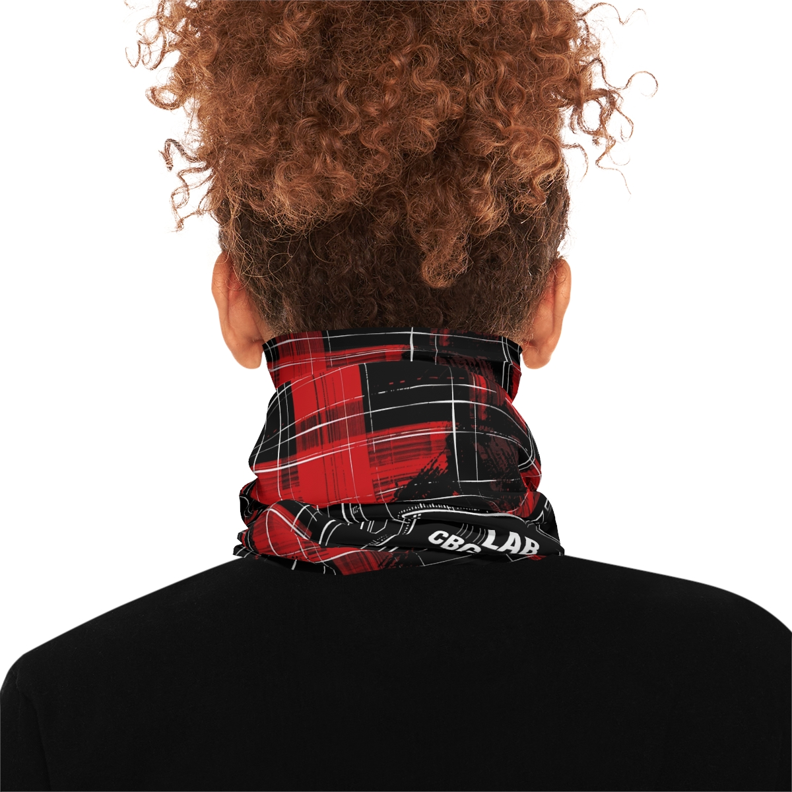
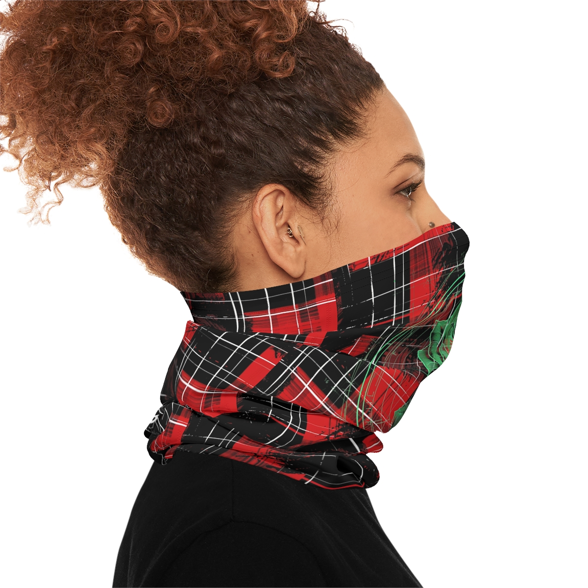

# C.B.G. Studio | Cyber-Tartan Technical Mask | Sub-Atomic Gaiter | Atomic Rose Plaid Face Shield | Industrial Punk Streetwear
**Status:** `UNPUBLISHED`
**Product ID:** `69929a1fe1f43fba0d0b04dd`
**Blueprint ID:** `970`
## Description
"Tradition Disrupted."
The Cyber-Tartan Technical Mask is a high-fidelity interface between classical pattern and digital signal loss. Part of our Cyber-Punk lab, the design features a heavy-set red tartan disrupted by glitched data shards. This aggressive "Field" is anchored by the Sub-Atomic "Atomic Rose"—rendered in phosphor green as a technical X-ray specimen. It is a garment designed for those who navigate the noise of the modern simulation with calculated intent.
Technical Specs
• Field: Glitched Cyber-Tartan (Red/Black/White).
• Anchor: Centered "Atomic Rose" X-ray diffraction pattern in Phosphor Green.
• Back Anchor: "LAB CBG-001" validation stamp and integrated avian legend.
• Material: Breathable, four-way stretch poly-blend for maximum comfort and high-fidelity print clarity.

## Keywords
`Cyberpunk Mask, Technical Gaiter, Punk Streetwear, Red Plaid Mask, CBG Studio, Atomic Rose, X-Ray Floral, Glitch Aesthetic, Industrial Noir, Stealth Gear, Tactical Face Cover, All Over Print, Lab Aesthetic`

## Gallery

## Blueprint Specifications
These midweight neck gaiters are made with a stretchy, moisture-wicking fabric blend of 90% Polyester and 10% Elastane. Add your custom touch and enjoy a personalized neck gaiter that is warm enough for skiing, yet breathable enough for a day on your bike, on the track, or for a trail run.
.: Material: 90% moisture-wicking polyester, 10% elastane (250 g/m²)
 
.:White interior
 
.:Provides sun protection
 
.:For sport activities or everyday use
 
.:Blank product sourced from China
 
.:NB! Size tolerance 0.5" (1.3 cm)

