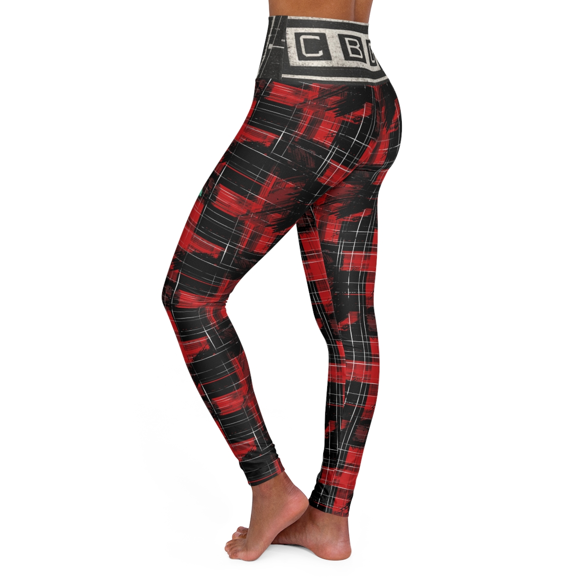

# Copy of C.B.G. Studio | Data-Stream Fishnet Leggings | Industrial Noir Technical Tights | Minimalist Techwear | Seamless Grid Leggings
**Status:** `UNPUBLISHED`
**Price:** $69.45
**Product ID:** `699817bb704f30dfc40270a2`
**Blueprint ID:** `516`
## Description
"Structural Transparency."
Reimagined for the minimalist, the "Data-Stream" Leggings trade chaotic distortion for mathematical clarity. By focusing on a clean, high-contrast white diamond mesh against a deep obsidian field, these leggings evoke the precision of a digital wireframe. The high-waisted band features a specialized "Blueprint" anchor, grounding the ethereal mesh with structural technical legends. It is the essential base layer for the Industrial Noir wardrobe.
Technical Specs
• Fit: High-waisted, compression-fit technical leggings.
• Pattern: 360-degree Seamless Fishnet Grid (Obsidian/White).
• Detailing: "Blueprint" waist-anchor with integrated goose silhouette.
• Material: Four-way stretch poly-spandex for deep color retention.

## Keywords
`Cyberpunk Leggings, Techwear Bottoms, Fishnet Mesh Style, Industrial Noir, CBG Studio, Minimalist Goth, All Over Print, Seamless Grid, Technical Tights, Aesthetic Apparel, Black and White, Lab Aesthetic, Modernist Gear`

## Gallery

