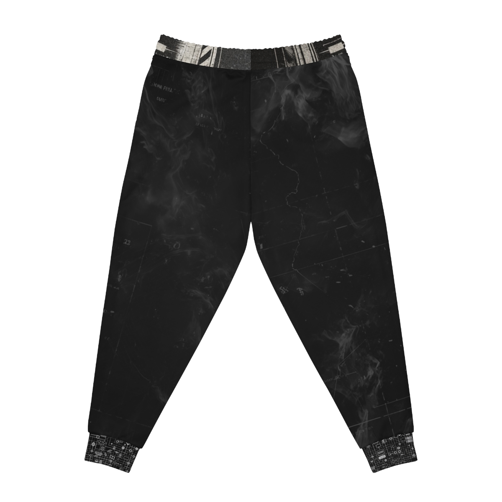

# Copy of Black Floral Pattern Joggers | Monochrome Botanical All-Over Print
**Status:** `UNPUBLISHED`
**Product ID:** `69981848e7a738262e01702c`
**Blueprint ID:** `591`
## Description
These personalized jogging pants come to add a custom style to your lounging as well as your workouts. Ensuring a cozy, unisex fit, these all-over-print joggers are cut & sew, meaning higher quality across the board both in materials used and in terms of production quality.NB! Please refer to the size guide for ankle cuff measurements. The fabric is tighter and not particulary stretchy in this area.- Material: 95% polyester, 5% spandex- Seam thread color automatically matched to design- Medium fabric (7.5 oz /yd² (250 g/m²))- Double layer side insert pockets- Soft fabric- Printed care label inside- White drawstring

## Gallery

## Blueprint Specifications
These personalized jogging pants come to add a custom style to your lounging as well as your workouts. Ensuring a cozy, unisex fit, these all-over-print joggers are cut & sew, meaning higher quality across the board both in materials used and in terms of production quality.  NB! Please refer to the size guide for ankle cuff measurements. The fabric is tighter and not particulary stretchy in this area.
.:Material: 95% polyester, 5% spandex
 
.:Seam thread color automatically matched to design
 
.:Medium fabric (7.5 oz /yd² (250 g/m²))
 
.:Double layer side insert pockets
 
.:Soft fabric
 
.:Printed care label inside
 
.:White drawstring

